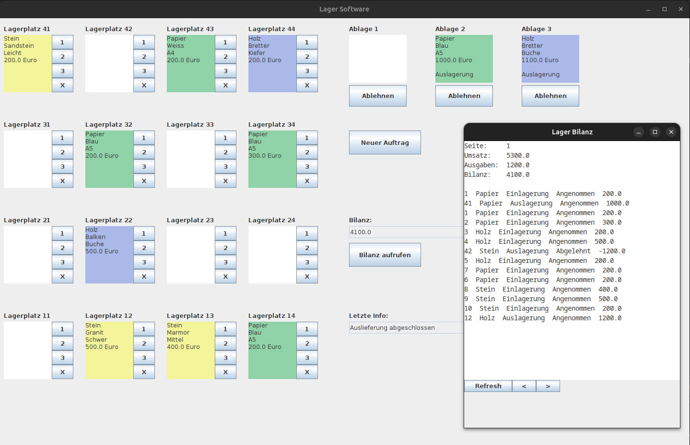

## Loesung zur Aufgabenstellung Programmieren II

Lagersoftware / LagerSpiel

Kurs: Programmieren II Sommersemester 2023  
Wo: DHBW Mosbach im Fach Angewandte Informatik  
Klasse: TINF-22-A  
Dozent: F.P.  
Student: B.U.  

Ich versichere hiermit, dass der Source Code komplett von mir selbst 
geschrieben wurde.

Entwurf einer Lagersoftware
- KISS Prinzip wurde in der GUI angewandt 🤡
- Negative Bilanz ist moeglich 💸

AENDERUNGEN / ERGAENZUNGEN in "Orders.java"

- Variable "len" fuer Gesamtlaenge "data"
- Methode "hasNext()" um zu checken ob Ende erreicht ist
- In "hasNext()" wurde lastOrder++ zu ++lastOrder (Aesthetik)
- Methode "decrementOrder()" um ein Element zurueck zu gehen

Code erfolgreich compiliert mit "openjdk 17.0.7 2023-04-18" unter Ubuntu mit Hilfe von Eclipse.

## Ein kleiner Ausschnitt
A screenshot of the most beautiful program ever written:

## The good

- Es funktioniert
- Es ist bunt
- Error Handling implementiert
- Detailierte Vorgaenge im Bilanz Fenster aufgezeichnet
- I would say: Bullet Proofed. Programm benutzt die einfachsten Elemente und kann hoffentlich in 10 Jahren noch kompiliert werden.

## The bad

- Teile der GUI public static
- Programm funktioniert auch ohne GUI. Diese Art von Separation erleichtert den Aufbau von Grund, aber die spaetere GUI Implementierung ist haesslich. Von der GUI wird querfeld auf Methoden aller Klassen zugegriffen
- Error Handling ein- zweimal zweckentfremdet
- Keine Bilder

Programm war nach 4 Tagen fertig programmiert. Zeit waren so 60 Tage. Am letzten Tage wurden noch Verbesserungen implementiert (Farbe, Match-Suche, Schoeneres Bilanz Fenster...).

- Man koennte hier noch so viel machen but fck it! Draussen scheint die Sonne und ich will chillen 🌞!

Abgabe wird nach Einsendeschluss auf meinem GitHub veroeffentlicht.

## Unsere Aufgabenstellung Sommer 2023

Allgemeine Hinweise:

Zu Implementieren ist die Programmieraufgabe in Java (Lauffähig in Java SE 17)
Die im Java JDK enthaltenen Bibliotheken dürfen Sie verwenden. Weitere Bibliotheken sind vorab mit dem Dozenten abzustimmen. Wenn Sie externe Bibliotheken verwenden, geben Sie bitte zusätzlich zu den Quelldateien eine lauffähige .jar ab
Zu den Aufgaben ist eine entsprechende grafische Benutzeroberfläche zu entwickeln. Das Hauptfenster soll eine Auflösung von 1440x900 Pixel haben.
Arbeiten Sie mit den Prinzipien der objektorientierten Programmierung wie in der Vorlesung behandelt
Vermeiden Sie jegliche Nutzung von Sonderzeichen (ä/ö/ü/ß) außerhalb von Kommentaren. Diese führen regelmäßig zu Problemen.
Abzugeben sind alle Quelldateien (*.java) in einem Zip gepackt über Moodle
Es muss eine Klasse "Start.java" mit einer main-Methode geben - hier wird das Programm gestartet
Start ist der 22.05.2023
Abgabeschluss ist der 02.07.2023, 23:59 Uhr
In die Bewertung fließen funktionale Anforderungen (wie unten beschrieben), aber auch subjektive Faktoren wie die Strukturierung des Codes oder die Gestaltung der GUI ein.
Die Arbeit ist keine Gruppenarbeit. Jeder muss einen individuellen Programmentwurf anfertigen

**Allgemeines**:
Entwickeln Sie ein Spiel, in der Sie in die Rolle eines Lageristen schlüpfen. Sie haben ein Lager und bekommen Aufträge, Waren einzulagern oder auszulagern. Für erledigte Aufträge bekommen Sie Geld. Ziel des Spiels ist es, so viel wie möglich einzunehmen.

**Das Lager**:
Spiel startet, das Lager wird angelegt. Sie besitzen ein Hochregallager mit vier Lagerplätzen Breite und vier Lagerplätzen Höhe. Auf jedem Lagerplatz findet eine Palette platz. Sie haben also insgesamt für 16 Paletten Platz. Ihr Lager ist aktuell leer. Befindet sich auf einem Lagerplatz ein Produkt, muss die Produktart und deren Eigenschaften erkennbar sein.

**Der Auftrag**: Über den Button "Neuer Auftrag" kann ein neuer Auftrag abgerufen werden. Es kann sich um einen Einlagerungsauftrag oder einen Auslagerungsauftrag handeln. Der Auftrag beinhaltet folgende Informationen: Produkt (siehe 3.), Belohnung (Wert in EUR). Es gibt keine Menge, es handelt sich immer um eine Einheit. Für die Erzeugung der Aufträge wird eine Java-Klasse bereitgestellt. Falls Änderungen / Ergänzungen der Java-Klasse notwendig werden, dokumentieren Sie dies in einer separaten Datei und geben Sie beide Dateien mit ab.

**Die Produkte**: Es gibt verschiedene Produkte mit jeweils verschiedenen Eigenschaften.

a) Papier:
Eigenschaften: Farbe (Weiß, Grün, Blau), Größe (A3, A4, A5)
Besonderheiten: Keine

b) Holz:
Eigenschaften: Art (Kiefer, Buche, Eiche), Form (Bretter, Balken, Scheit)
Besonderheiten: Keine

c) Stein:
Eigenschaften: Art (Marmor, Granit, Sandstein), Gewicht (Leicht, Mittel, Schwer)
Besonderheiten: Schwere Steine sind zu Schwer für das Regal und können nur auf der untersten Ebene eingelagert werden. Mittelschwere können nicht in der obersten Ebene eingelagert werden.

**Die Abwicklung**:

Einlagerungsauftrag: Es muss ein freier Lagerplatz ausgewählt werden. Ist das Produkt nicht für den Lagerplatz geeignet (siehe auch Punkt 3), erscheint eine entsprechende Fehlermeldung. Anderenfalls wird die Palette eingelagert und die Belohnung gutgeschrieben
Auslagerungsauftrag: Es muss ein Lagerplatz ausgewählt werden, an dem sich genau dieses Produkt befindet. Die Palette wird ausgelagert und die Belohnung wird gutgeschrieben.

**Die Lagerverwaltung**:

Ein Produkt kann verschrottet werden, das kostet 300 EUR.

**Das Auftragsmanagement**:

In Ihrem Auftragseingang befinden sich drei Fächer. Es können demnach bis zu drei Aufträge gleichzeitig bearbeitet werden (weitere Klicks auf "Neuer Auftrag"). So können Sie einen Auftrag auch zunächst einmal zurückstellen. Ein Auftrag kann auch abgelehnt werden, allerdings wird die Belohnung als Vertragsstrafe vom Kontostand abgezogen.

**Die Bilanz**:

Natürlich muss immer der Kontostand sichtbar sein. Zusätzlich gibt es einen Button "Bilanz". Die Bilanz öffnet sich in separatem Fenster mit eigener grafischer Benutzeroberfläche. Sie zeigt folgende Informationen: Umsätze (Summe), Kosten (Summe) und Einzelbuchungen, also eine Tabelle mit jeder Veränderung des Kontostands. Jede Buchung ist mit einem Text (Einlagerungsauftrag, Auslagerungsauftrag, Verschrottung usw.) und einem Betrag versehen.
